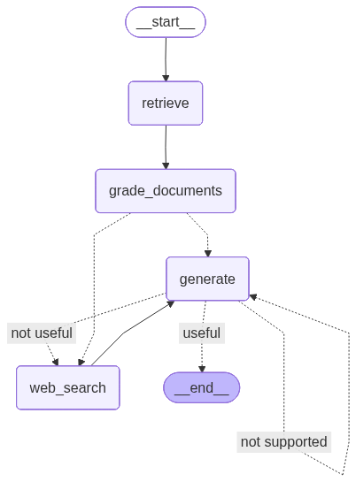

# AgenticRAG

Advanced RAG control flow based on Self-RAG, Corrective RAG and Adaptive RAG adding reflexion to the workflow. The agent reflects on the retrieved documents from the vector store to check whether they are relevant to the user's query, curate them with new information from the web if needed. The agent also reflects on its answer to check if the answer is grounded in the documents and that the answer answers indeed the question. Additionaly, there is a routing element to route the request to the correct data store - web or vector store.

The vectorstore contains documents related to agents, prompt engineering, and adversial attacks.

The sources of the documents are:


> https://lilianweng.github.io/posts/2023-06-23-agent/
> https://lilianweng.github.io/posts/2023-03-15-prompt-engineering/
> https://lilianweng.github.io/posts/2023-10-25-adv-attack-llm/



## Prerequisites

Before getting started make sure you have the prerequisites set.

- Python 3.12 or higher: https://www.python.org/downloads/
- uv: https://docs.astral.sh/uv/getting-started/installation/
- OpenAI API Key: https://platform.openai.com/
- Pinecone API Key: https://pinecone.io/
- Tavily API Key: https://www.tavily.com/
- (Optional) LangSmith API Key: https://smith.langchain.com/

## Environment Setup

To get started with the project follow these steps:

1. **Create a Pinecone vectorstore index:**
Go to: https://pinecone.io/, log into your user and hit **Create index.** Give the index a name and in the **Configuration** tab **make sure you select `text-embedding-3-small`** and the **Dimension to 1024.** You can leave the rest of the configurations as default.

2. **Setup environment variables:**
Create a .env file with the below environment variables and fill it in with your environment variables:
```.env
OPENAI_API_KEY=<your-openai-api-key>
LANGSMITH_TRACING=<'true' or 'false' to enable tracing in LangSmith. If 'true' you need to also specify an API key in LANGSMITH_API_KEY>
LANGSMITH_ENDPOINT=<Required only if 'LANGSMITH_TRACING' is set to 'true. If 'LANGSMITH_TRACING' is set to 'true' fill this variable with the endpoint: https://api.smith.langchain.com>
LANGSMITH_API_KEY=<Required only if 'LANGSMITH_TRACING' is set to 'true'. >
LANGSMITH_PROJECT=<Required only if 'LANGSMITH_TRACING' is set to 'true'. If 'LANGSMITH_TRACING' is set to 'true' fill this variable with your project name. It can be any name.>
TAVILY_API_KEY=<your tavily api key>
PINECONE_API_KEY=<your pinecone API key>
INDEX_NAME=<the index name you set in the first step.>
PYTHONPATH=<The root path of this project. Example: C:\\Projects\\AgenticRAG-LangGraph>
```

## Ingest the documents

To ingest the documents run the following command: `uv run ingestion.py`

## How to Run

To run the project run the following command: `uv run main.py` and you can chat with the agent. To stop the interaction press: `CTRL + C`

## Testing the app

If you wish to test the application run the following command: `uv run pytest . -s -v`